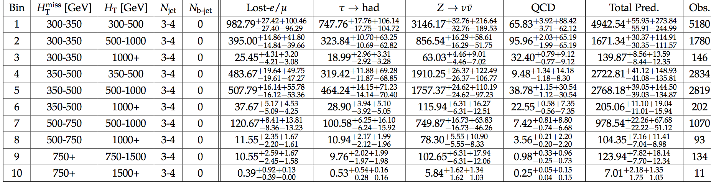
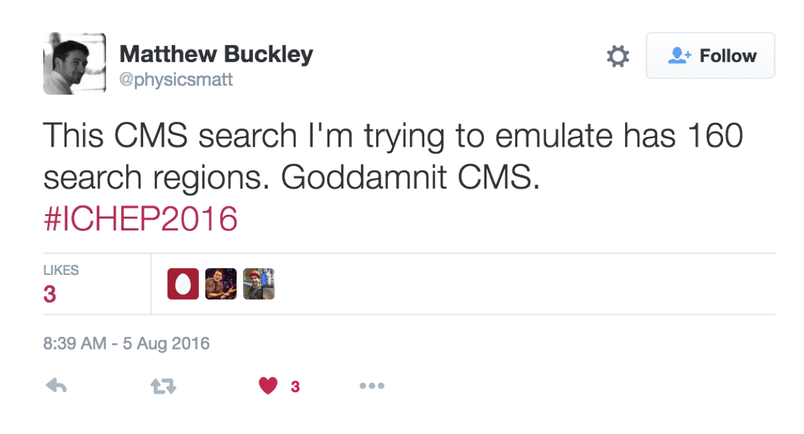

# CMS Mini Analysis Tool

## Overview

RA2 (CMS-PAS-SUS-16-014) is an inclusive and generic search for evidence of physics beyond the standard model in data collected by the CMS detector at the CERN LHC. The data are examined in 160 exclusive search regions (bins) defined by simple particle physics observables, typically resulting in plots like [this](http://cms-results.web.cern.ch/cms-results/public-results/preliminary-results/SUS-16-014/CMS-PAS-SUS-16-014_Figure_006.pdf) and tables [like](http://cms-results.web.cern.ch/cms-results/public-results/preliminary-results/SUS-16-014/CMS-PAS-SUS-16-014_Table-aux_001.pdf) [these](http://cms-results.web.cern.ch/cms-results/public-results/preliminary-results/SUS-16-014/CMS-PAS-SUS-16-014_Table-aux_004.pdf). A likelihood fit to the data in the 160 bins is used to test the compatability of the data with the standard model (background)-only hypothesis and of several signal hypotheses involving various models of new physics. 

This multi-bin approach provides sensitivity to a range of new physics models, but it presents a number of hurdles to theoretical physics looking to reproduce the analyis and reinterpret the results in the context of their models (according to [Twitter](https://twitter.com/physicsmatt/status/761587454247833600), at least). 

This tool is intended to make their jobs (and ours) a little bit easier. It takes as input a signal model with a distribution of the expected signal contribution in each of the 160 bins, designs a simple one-bin analysis, and produces a skeleton of a physics paper describing the results of this analysis.

It tests the signal-vs-background discrimination of various combinations of bins to find the optimal single-bin (a merged subset of the 160 bins) analysis, then runs statistical hypothesis tests to evaluate the compatibility of the data with the background-only and signal+background huypotheses.

