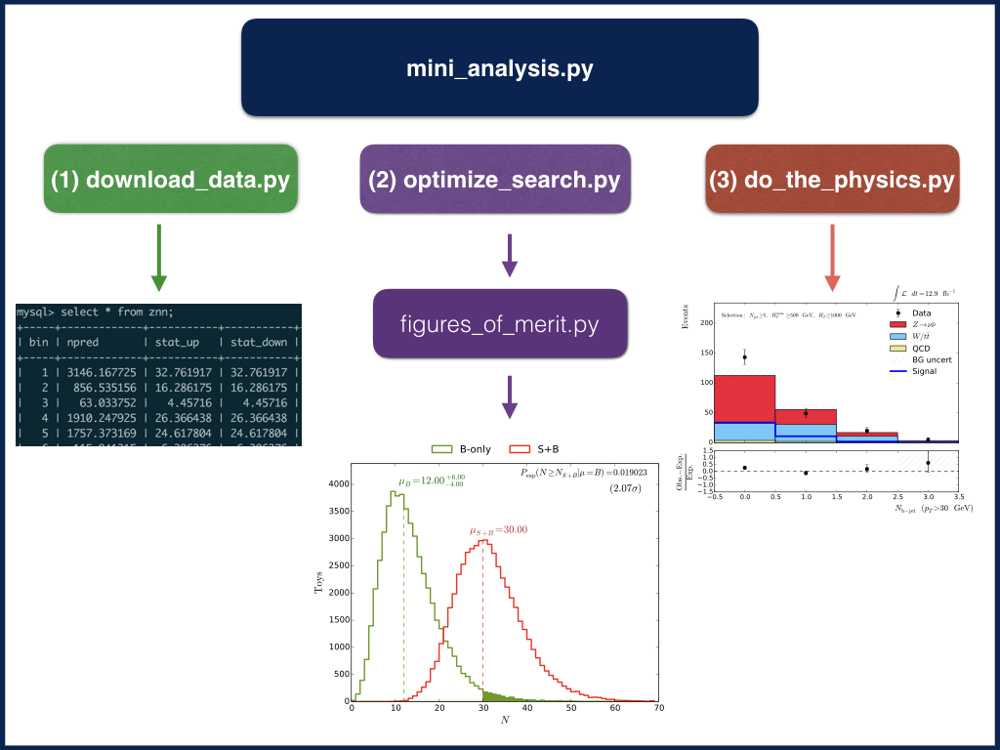
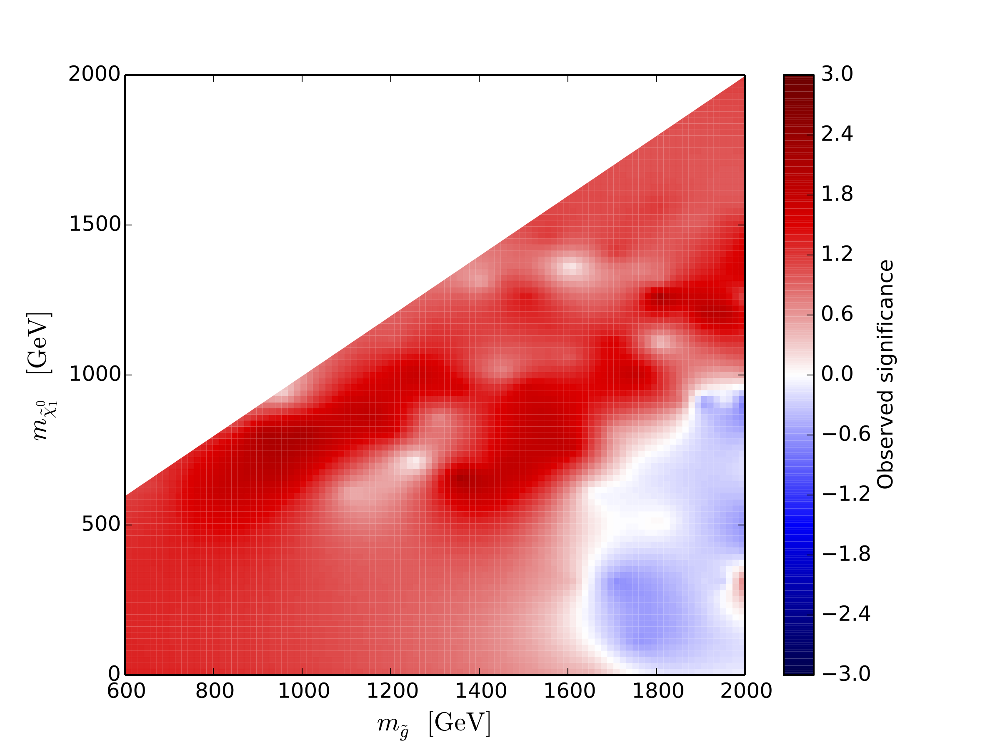

## Walkthrough




### Step 1: read the data
In [download_data.py](./download_data.py), the results of the analysis, including the observed data yields and the data-driven background measurements and uncertainties are read in through a SQL database, as are the parameters of the specified signal model.

### Step 2: optimize and design the simple one-bin analysis
In [optimize_search.py](./optimize_search.py) we design the most sensitive one-bin analysis that we can construct from various combinations of the 160 bins. We opitmize the discovery significance or p-value for an observation of the expected number of signal plus background events in one ``aggregate`` bin under the background-only hypothesis. To do this, we run a series of toy experiments in [figures_of_merit.py](./figures_of_merit.py#L35) to generate a PDF for the number of events to be observed in the aggregate bin given a mean value for the background expectation and an asymmetric systematic uncertainty on that background.

Test the significance calculator by running this command from [demo](../):

```
python scripts/figures_of_merit.py 40 25 5 5
```

### Step 3: analyze the data in the bins, create a skeleton of a reinterpretation paper
Now we turn to "analyzing" the data in that aggegate bin. To gain some intuition and extract physics insights from the data, in [do_the_physics.py](./do_the_physics.py), we generate a set of plots of the distributions of particle physics observables for the expected signal, estimated background, and observed data in search regions relevant to the aggregate bin. These plots are assembled into a LaTeX document, which also summarizes the contents of the aggregate bin, the expected sensitivity of the analysis, and the significance of any discrepancy between the observed data and the background-only expectation.

Run the tool on an interesting signal model by running this command from [demo](../):

```
python scripts/mini_analysis.py demo T1qqqq 1500 700 $USER
```

### What can this tool be used for?
One could run on a set of model points and examine the observed significance in each simplified analysis. The model points corresponding to analyses with significant excesses (red, below) could be worth studying further...


